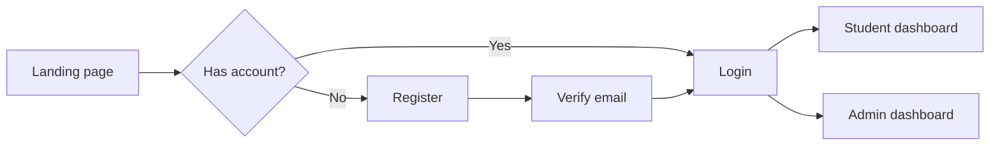
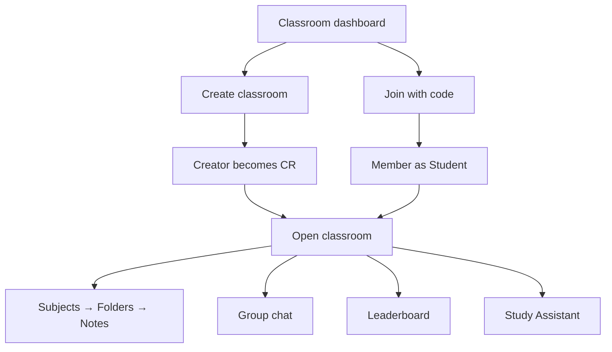
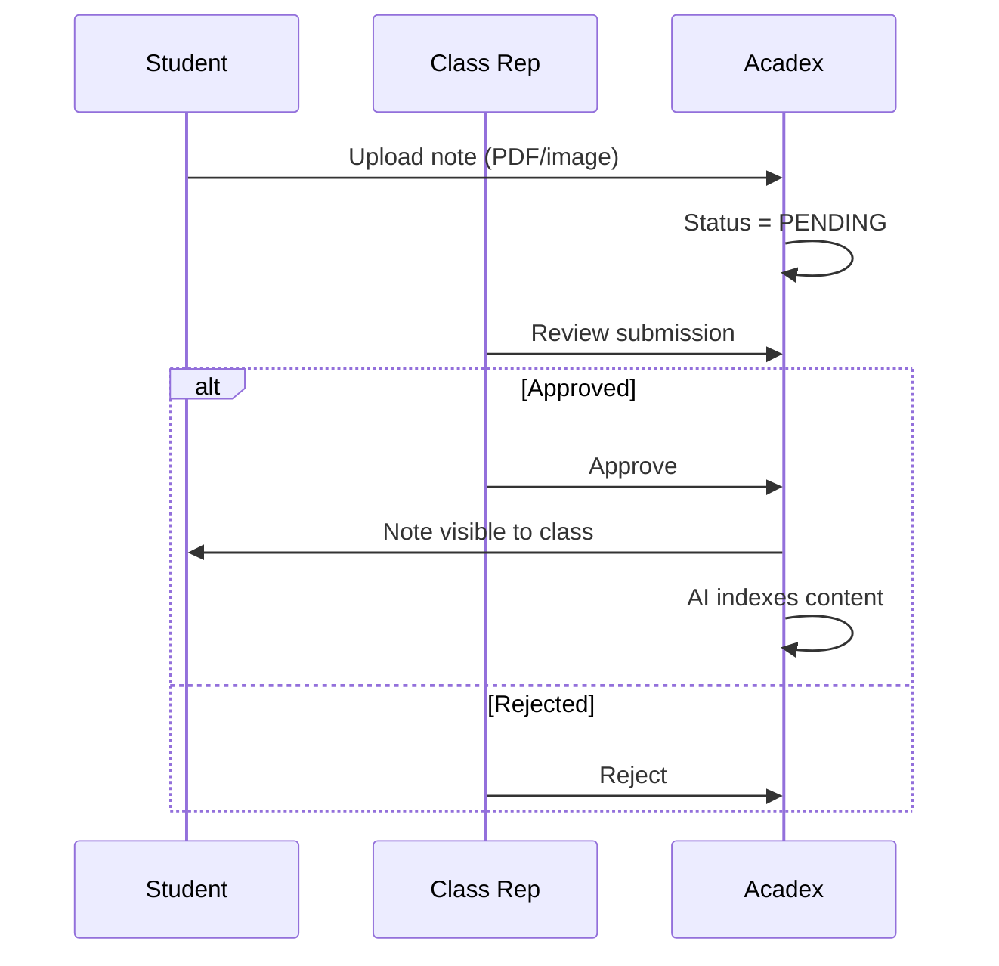
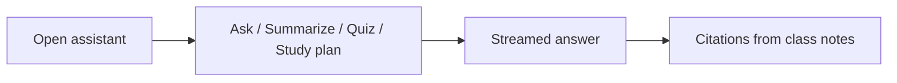
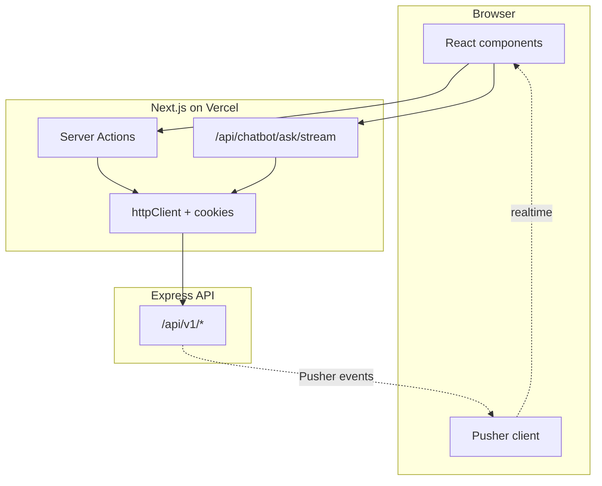

# Acadex Client — Product & Technical Documentation

**Acadex** is a classroom-first study platform built for students in Bangladesh and similar academic contexts. The client is a modern web app where learners join digital classrooms, share notes, collaborate in real time, and use an AI study assistant grounded in their class materials.

| | |
|---|---|
| **Live app** | [acadex-client.vercel.app](https://acadex-client.vercel.app) |
| **API** | [acadex-server.vercel.app/api/v1](https://acadex-server.vercel.app/api/v1) |
| **Stack** | Next.js 16 · React 19 · TypeScript · Tailwind CSS 4 |

---

## Table of Contents

1. [What Acadex Does](#what-acadex-does)
2. [Who Uses It](#who-uses-it)
3. [Core User Flows](#core-user-flows)
4. [Feature Guide](#feature-guide)
5. [Information Architecture](#information-architecture)
6. [Technical Overview](#technical-overview)
7. [Project Structure](#project-structure)
8. [Local Development](#local-development)
9. [Deployment](#deployment)

---

## What Acadex Does

Acadex replaces scattered WhatsApp groups, random Google Drive links, and generic AI tools with **one classroom hub**:

- **Organize** subjects, folders, and shared notes in a clear hierarchy  
- **Collaborate** through comments, favorites, leaderboards, and live group chat  
- **Study smarter** with an AI assistant that answers from *your class notes*, not the open internet  
- **Stay informed** via admin notices and CR-led moderation  

The product is designed for real academic workflows: note approval, class representative (CR) roles, institution levels (school / college / university), and student utility tools (GPA calculator, timetables, cover pages).

---

## Who Uses It

### Platform roles

| Role | Who they are | What they can do in the app |
|------|----------------|-----------------------------|
| **Student** | Default user | Join classrooms, upload notes, chat, comment, favorite, use AI assistant, access study tools |
| **Class Representative (CR)** | Student promoted inside a classroom | Everything a student can do **plus** approve notes, manage subjects/folders, manage members, moderate chat |
| **Admin** | Platform moderator | Approve/ban classrooms, view stats, publish global notices |
| **Super Admin** | Platform owner | All admin powers **plus** create and manage admin accounts |

### Classroom membership (separate from platform role)

| Membership | Permissions in that classroom |
|------------|-------------------------------|
| **Student** | Browse approved notes, upload (pending approval), chat, comment, use AI |
| **CR** | See all note statuses, approve/reject uploads, edit curriculum structure, manage members, delete any chat message |

> A regular student can be **CR in one classroom** and a normal member in another — permissions are per classroom, not global.

---

## Core User Flows

### 1. Onboarding



1. Visit the homepage or go to **Login** / **Register**  
2. Sign up with email/password or **Continue with Google**  
3. Verify email if required  
4. Land on **Classroom dashboard** (students) or **Admin command center** (admins)

---

### 2. Join or create a classroom



| Action | Path | Result |
|--------|------|--------|
| Create classroom | `/dashboard/classroom/create` | You become **CR**; classmates join with a shareable code |
| Join classroom | `/dashboard/classroom/join` | Enter join code → added as **Student** |
| Open classroom | Sidebar → classroom name | Subject list, chat button, leaderboard links |

---

### 3. Share and discover notes



1. Navigate **Classroom → Subject → Folder** (optional)  
2. Upload note files (drag-and-drop supported)  
3. CR reviews pending notes from the moderation view  
4. Approved notes appear for all members; favorites and comments unlock on the note detail page  

---

### 4. Real-time classroom chat

| Step | What happens |
|------|----------------|
| Open chat | Sidebar **Messages** or **Group Chat** on classroom page → `/dashboard/classroom/[id]/chat` |
| Read history | Latest 50 messages load; scroll up for older messages |
| Send message | Type and press **Send** (Enter) or click the button |
| Live updates | New messages appear instantly via **Pusher** (no refresh) |
| Delete | Remove your own message; **CR** can remove any message |

---

### 5. AI Study Assistant



1. Open the floating **Study Assistant** on a classroom subject or note page  
2. Choose mode: **Ask**, **Summarize**, **Quiz**, or **Study Plan**  
3. Pick explanation level: Beginner, Exam, or Advanced  
4. Receive a **streaming** response with citations tied to indexed classroom notes  
5. **CR only:** reindex notes and view indexing status when content changes  

> Streaming is proxied through `/api/chatbot/ask/stream` so authentication works securely in production.

---

### 6. Admin workflows

| Task | Where |
|------|--------|
| View platform stats | `/admin/dashboard` |
| Approve/reject/ban classrooms | `/admin/classrooms-management` |
| Publish student notice | `/admin/dashboard/settings` |
| Manage admin accounts | `/admin/admin-management` (Super Admin only) |

---

## Feature Guide

### Classroom workspace
- Searchable grid of joined classrooms  
- Copy join code, leave classroom (students only; CR cannot leave without transfer)  
- Per-classroom leaderboard and contribution rankings  

### Curriculum structure
```
Classroom
 └── Subject (e.g. CSE-221)
      └── Folder (optional, e.g. Midterm)
           └── Notes (PDF / images)
```

### Notes
- Upload, preview, and download files  
- Status badges: Pending · Approved · Rejected  
- Search and pagination on listing pages  

### Social & engagement
- **Favorites** — personal saved notes at `/dashboard/favorites`  
- **Comments** — one-level replies and likes on note detail pages  
- **Leaderboard** — cross-classroom and per-classroom views  

### Student services (browser-based tools)
| Service | Purpose |
|---------|---------|
| Cover page generator | Lab/assignment cover sheets |
| Exam planner | Countdown and study schedule |
| Flashcards | Create and study decks |
| GPA calculator | Bangladesh grading scale |
| Timetable builder | Weekly class schedule |

### Donations
- **Support Us** on the homepage → Stripe checkout → success/cancel pages  

### Theme
- Light / dark / system mode in **Settings**  

---

## Information Architecture

### Public routes
| Route | Purpose |
|-------|---------|
| `/` | Marketing landing page |
| `/login`, `/register` | Authentication |
| `/Developer` | Setup guide for contributors |
| `/Privacy-Policy`, `/Terms-of-Services`, `/Help-Center` | Legal & help |

### Student dashboard (`/dashboard/*`)
| Route | Purpose |
|-------|---------|
| `/dashboard/classroom` | My classrooms |
| `/dashboard/classroom/[id]` | Subjects + Study Assistant |
| `/dashboard/classroom/[id]/chat` | Group chat |
| `/dashboard/classroom/[id]/manage` | CR member management |
| `/dashboard/classroom/leaderboard` | Leaderboards |
| `/dashboard/favorites` | Saved notes |
| `/dashboard/services` | Study tools hub |
| `/dashboard/settings` | Theme preferences |

### Admin (`/admin/*`)
| Route | Purpose |
|-------|---------|
| `/admin/dashboard` | Stats overview |
| `/admin/classrooms-management` | Classroom moderation |
| `/admin/admin-management` | Admin CRUD (Super Admin) |
| `/admin/dashboard/settings` | Notices & theme |

---

## Technical Overview

*For recruiters and technical reviewers.*

### Highlights
- **Next.js 16 App Router** with route groups for marketing, auth, and dashboard shells  
- **Server Actions** as the primary data layer — secure cookie forwarding to the API  
- **Real-time chat** with Pusher (client subscribe, server publish)  
- **AI streaming** via same-origin API proxy (cross-origin auth solved correctly)  
- **Role-based routing** in `proxy.ts` (auth, email verification, password reset gates)  
- **TanStack Query** for client cache; **Zod** for validation  
- **shadcn/ui + Radix** component system with Tailwind CSS 4  

### Request flow



### Why Server Actions for API calls?
Auth tokens are stored in **httpOnly cookies** on the client domain. Browser `fetch` to a separate API domain cannot attach those cookies. Server Actions read cookies on the Next.js server and forward them to the backend — the same pattern used for comments, notes, and chat.

---

## Project Structure

```
src/
├── app/                    # Next.js App Router pages & API routes
│   ├── (authRouteGroup)/   # Login, register, verify
│   ├── (dashboardLayout)/  # Student + admin dashboards
│   ├── (commonLayout)/     # Marketing & legal pages
│   └── api/                # OAuth complete, chatbot stream proxy, file proxy
├── actions/                # Server Actions ("use server")
├── services/               # Thin API wrappers (httpClient)
├── components/
│   ├── modules/            # Feature UI (classroom, chatbot, notes, admin…)
│   ├── chat/               # Classroom group chat
│   └── ui/                 # shadcn primitives
├── hooks/                  # useClassroomRole, useNotes, etc.
├── lib/                    # Auth, axios, chatbot stream, cookies
└── types/                  # TypeScript domain types
```

---

## Local Development

### Prerequisites
- Node.js 20+
- Running [Acadex Server](../Acadex-server) on port 5000

### Setup

```bash
pnpm install   # or npm install

# Create .env.local
NEXT_PUBLIC_API_BASE_URL=http://localhost:5000/api/v1
NEXT_PUBLIC_BASE_URL=http://localhost:3000
ACCESS_TOKEN_SECRET=<same as server>

# Optional — real-time chat
NEXT_PUBLIC_PUSHER_KEY=<your key>
NEXT_PUBLIC_PUSHER_CLUSTER=<your cluster>

pnpm dev       # http://localhost:3000
```

### Scripts

| Command | Description |
|---------|-------------|
| `pnpm dev` | Development server |
| `pnpm build` | Production build |
| `pnpm start` | Serve production build |
| `pnpm lint` | ESLint |

---

## Deployment

Deployed on **Vercel** as a standard Next.js project.

| Variable | Required | Notes |
|----------|----------|-------|
| `NEXT_PUBLIC_API_BASE_URL` | Yes | Production API URL |
| `NEXT_PUBLIC_BASE_URL` | Yes | Frontend origin |
| `ACCESS_TOKEN_SECRET` | Yes | Must match server |
| `NEXT_PUBLIC_PUSHER_KEY` | For chat | Public Pusher key |
| `NEXT_PUBLIC_PUSHER_CLUSTER` | For chat | e.g. `ap1` |

Ensure the server `FRONTEND_URL` and CORS settings include your Vercel client URL.

---

## Related Documentation

- [Acadex Server documentation](../Acadex-server/DOCUMENTATION.md) — API, database, auth, integrations  
- In-app developer page: `/Developer`

---

*Acadex Client — built for students who study together.*
